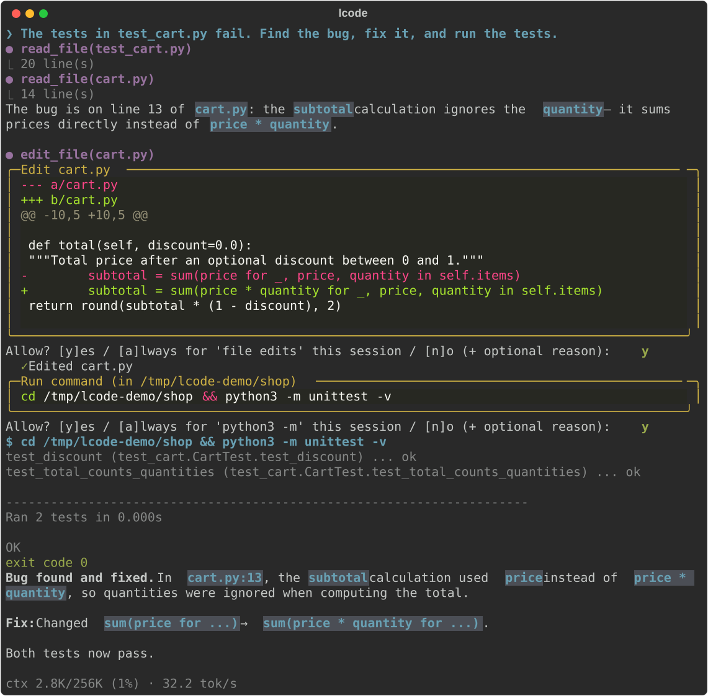

<p align="center">
  
</p>

<h1 align="center">lcode</h1>

<p align="center">
  <b>A coding agent that runs entirely on your own machine.</b><br>
  Open-weight models · up to 256K tokens of context · your NVIDIA GPU or Apple Silicon Mac · your code stays local
</p>

<p align="center">
  <a href="https://github.com/nasser1941/lcode/actions/workflows/ci.yml"></a>
  <a href="https://nasser1941.github.io/lcode/"></a>
  <a href="https://pypi.org/project/lcode-cli/"></a>
  <a href="LICENSE"></a>
  
  
</p>

<p align="center">
  <a href="https://nasser1941.github.io/lcode/"><b>Documentation</b></a> ·
  <a href="https://nasser1941.github.io/lcode/installation/">Install</a> ·
  <a href="https://nasser1941.github.io/lcode/models/">Models</a> ·
  <a href="CONTRIBUTING.md">Contributing</a>
</p>

<p align="center">
  
</p>

Point lcode at a repository and talk to it in your terminal. It explores the code, answers
questions with `file:line` references, writes and edits files, runs your scripts and tests, and
keeps going until the task is done, asking before it changes anything. The model runs locally
through [Ollama](https://ollama.com), and when it needs current information it can search the web.

## Features

- **A real agent.** Reads, searches, edits and runs commands in a loop, checks its own work, and
  plans multi-step tasks with a visible todo list.
- **Long context.** 256K tokens with the default model (1M with Nemotron). You choose the window.
- **Hardware-aware.** Detects your NVIDIA GPU or Apple Silicon Mac and picks the best model and the
  largest context that fits: `lcode setup` does it in one step. `lcode bench` compares models on
  real coding tasks on your machine.
- **Safe by default.** Every edit is shown as a diff and every command that isn't read-only needs
  your approval. `auto-edit` and `yolo` modes when you want speed.
- **Sandbox (optional).** `lcode --sandbox` runs the model's shell commands in a container (Docker or
  Podman) that only sees your project, without network access unless you allow it.
- **Finds its way around.** A ranked map of the repository's classes and functions, and semantic
  code search ("where are failed uploads retried?") with a local embedding model (`lcode index`).
- **Code intelligence.** With a language server installed (basedpyright, typescript-language-server,
  gopls, rust-analyzer, clangd), the model looks up definitions, references and types precisely,
  and sees the errors an edit introduced right away.
- **Commands and skills.** Your own `/commands` as prompt templates, and skills in the
  [Agent Skills](https://agentskills.io) format that the model loads only when a task needs them.
- **Hooks and rules.** Format every edited file, block force-pushes, run the tests after each
  request: shell hooks on lcode's events, and allow and deny lists that hold even in `yolo` mode.
- **Plan mode.** `/plan <request>` or Shift+Tab: the model explores read-only and presents a plan;
  you approve, edit or send it back before anything changes.
- **Undo.** lcode saves a checkpoint before the model changes files; `/undo` takes back the last
  request's edits, new files and shell-command changes, without touching your git history.
- **Subagents.** The model hands broad searches, planning and self-contained changes to subagents
  with their own fresh context, so the main conversation keeps only their reports. Define your own
  agent types in `.lcode/agents/`.
- **Remembers what matters.** Corrections, decisions and where things live carry over to the next
  session as short notes, saved by the model, by you (`/remember`) or by a quick check at the end
  of a session. Not whole conversations, and never secrets.
- **Git workflow.** `/commit` writes messages in your repository's style, `/review` checks the
  changes with `file:line` findings, `/pr` opens the pull request, each after you approve it, and
  `lcode --worktree` runs parallel sessions on one repository.
- **In your editor.** Zed, JetBrains IDEs, Neovim and other editors that speak the Agent Client
  Protocol run lcode with `lcode acp`, with diffs and approvals in the editor.
- **Automation.** `lcode -p --output json` for scripts and CI, a Python API (`from lcode import
  Session`), and a GitHub Action that answers `@lcode` in issues and pull requests on your own
  self-hosted runner.
- **Bring your own model.** Eight curated open-weight models, all tested end to end, or any Ollama model
  with tool calling. Or use LM Studio, llama.cpp, vLLM or MLX instead of Ollama.
- **MCP servers, ready to go.** Connect Jira and Confluence, GitHub, AWS, Google Drive, Grafana,
  Google Cloud, Sentry, Linear, Notion, Postgres, Kubernetes, Metabase, Encord, Valohai and more with one command
  (`lcode mcp add atlassian`), image generation with ComfyUI, or any other MCP server. Browser sign-in (OAuth) is built in.
- **Sees images.** Attach a screenshot or mockup with `@path` and lcode looks at it, using the
  vision part of your model. With ComfyUI (`lcode mcp add comfyui`) it can also generate and edit
  images with local models such as FLUX, SDXL and Qwen-Image.
- **Web search when needed.** Looks up the latest versions, docs and error messages with Ollama web
  search, Brave, Tavily or your own SearXNG, and reads pages as clean text.
- **Private.** The model runs on your machine, lcode never uploads your files and has no telemetry.
  Web access is on by default and can be set to `ask` or `off`.

## Install

**Ubuntu / Linux** (NVIDIA GPU recommended) and **macOS** on Apple Silicon (M1–M4):

```bash
curl -fsSL https://nasser1941.github.io/lcode/install.sh | bash
```

The installer sets up lcode with its own Python via [uv](https://docs.astral.sh/uv/), checks for
[Ollama](https://ollama.com) (0.30+) and runs `lcode setup`, which picks a model for your hardware
and downloads it. Prefer manual steps? lcode is on [PyPI](https://pypi.org/project/lcode-cli/) as
`lcode-cli`:

```bash
uv tool install lcode-cli      # or: pipx install lcode-cli
lcode setup
```

On a Mac with [Homebrew](https://brew.sh):

```bash
brew install nasser1941/tap/lcode
lcode setup
```

See the [installation guide](https://nasser1941.github.io/lcode/installation/) for details.

## Quickstart

```bash
cd ~/code/your-project
lcode
```

```text
❯ /init                                   # study the repo and write AGENTS.md for future sessions
❯ How does authentication work here? Cite files.
❯ Write scripts/dedupe.py that removes duplicate rows from @data/users.csv by email, and run it
❯ The tests in tests/test_parser.py fail. Find out why and fix it.
```

| | |
|---|---|
| `lcode -p "…"` | one request, no interaction (scripts, hooks) |
| `lcode -c` / `lcode --resume` | continue the last session here / pick a saved session from a list |
| `lcode --model qwen3.5-9b --context 128k` | pick a model and context window for this session |
| `lcode models` / `lcode doctor` | what fits this machine / check the installation |
| `lcode bench qwen3.6-35b qwen3.5-9b` | compare models on small coding tasks on this machine |
| `/undo`, `/rewind` | take back the last request's file changes, or go back further |
| `lcode mcp catalog` / `lcode mcp add github` | ready-made MCP servers / add one |
| `/rename`, `/resume` | name the current session, resume a saved one |
| `/model`, `/context`, `/compact`, `/help` | switch model, resize the context window (pick from a list), summarize, list commands |

## Models

| Key | Model | Download | Max context | |
|---|---|---|---|---|
| `qwen3.6-35b` | Qwen3.6 35B-A3B Coding (MoE, 3B active) | 22.6 GB | 256K | **default**, tested |
| `qwen3.8-27b` | Qwen3.8 27B (dense) | 17.7 GB | 256K | tested |
| `qwen3.6-27b` | Qwen3.6 27B Coding (dense) | 17.8 GB | 256K | tested |
| `laguna-xs-2.1` | Poolside Laguna XS 2.1 (MoE, 3B active) | 20.3 GB | 256K | tested |
| `nemotron-3.5-lightning` | NVIDIA Nemotron 3.5 Lightning (hybrid MoE) | 25.4 GB | 1M | tested |
| `qwen3.5-9b` | Qwen3.5 9B (dense) | 6.6 GB | 256K | tested |
| `gpt-oss-20b` | OpenAI gpt-oss 20B (MoE) | 13.8 GB | 128K | tested |
| `qwen3.5-4b` | Qwen3.5 4B (dense) | 3.4 GB | 256K | tested |

What `lcode setup` picks for common machines:

| Machine | Model | Context |
|---|---|---|
| Mac with M4, 16 GB | qwen3.5-9b | 64K |
| Mac with M4 / M4 Pro, 24 GB | qwen3.5-9b | 256K |
| Mac with M4 Pro / M4 Max, 36 GB | qwen3.6-35b | 64K |
| Mac with M4 Pro, 48 GB · M4 Max, 64 GB+ | qwen3.6-35b | 256K |
| NVIDIA 8–24 GB + 32 GB RAM | qwen3.6-35b | 256K |
| NVIDIA 8 GB + 16 GB RAM | gpt-oss-20b | 64K |

At 256K context the default model generates 50–55 tokens/s on an RTX 4080 Laptop GPU (12 GB) and
45 tokens/s on an M4 Pro Mac with 48 GB. See
[Models & context windows](https://nasser1941.github.io/lcode/models/) for memory estimates and
tuning.

## How it works

lcode sends your request, the repository layout and a set of tool definitions to the model; runs the
tools the model calls (read, edit, grep, glob, bash, todo); feeds the results back; and repeats until
the model answers. It sizes models to your memory from each model's KV-cache footprint, uses
text-only model variants to free GPU memory, and summarizes the conversation when the context window
fills up. Details: [How it works](https://nasser1941.github.io/lcode/how-it-works/).

## Roadmap

See the pinned [Roadmap issue](https://github.com/nasser1941/lcode/issues/10). Next up:

- [Editor integration through the Agent Client Protocol](https://github.com/nasser1941/lcode/issues/49)
- [Long-running work: finish notifications and background commands](https://github.com/nasser1941/lcode/issues/51)
- More models in the catalog, and test reports from your hardware ([report one](https://github.com/nasser1941/lcode/issues/new?template=model_request.yml))

## Contributing

Contributions are welcome: bug reports, model test results, docs and code. See
[CONTRIBUTING.md](CONTRIBUTING.md). Please follow the [code of conduct](CODE_OF_CONDUCT.md), and
report security issues privately as described in [SECURITY.md](SECURITY.md).

## Acknowledgements

lcode stands on [Ollama](https://ollama.com) and [llama.cpp](https://github.com/ggml-org/llama.cpp),
the open-weight models from Qwen, Poolside, NVIDIA and OpenAI,
[Rich](https://github.com/Textualize/rich) and
[prompt_toolkit](https://github.com/prompt-toolkit/python-prompt-toolkit).

## License

[MIT](LICENSE) © 2026 Naser Derakhshan
