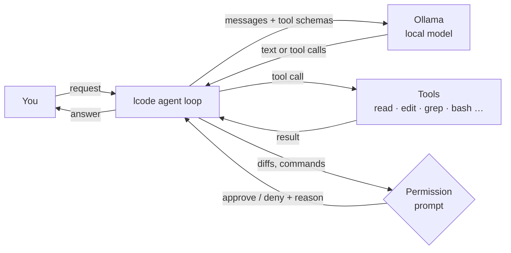

# How it works

lcode is a small Python program (about 2,000 lines) around one idea: let a local model call tools in
a loop until the task is done.

## The agent loop

1. Your message goes to the model along with a system prompt (environment, repository layout,
   `AGENTS.md`) and the JSON schemas of the tools.
2. The response streams back. Reasoning shows as a spinner (or text with `--show-thinking`); the
   answer is rendered as markdown, block by block.
3. If the model called tools, lcode runs them, asking for permission where needed, and appends the
   results to the conversation.
4. Back to step 2 until the model answers without calling a tool (with a safety cap of 150 steps).

All tools return text, and failures come back to the model as `Error: …` messages rather than
crashing the session, so the model can correct itself (for example re-read a file when an edit
didn't match).

## Context management

Ollama keeps the processed conversation in its KV cache, so each turn only processes the new tokens.
lcode tracks how full the window is from Ollama's token counts. At 85% it asks the model to write a
summary of the conversation (goals, findings, files changed, next steps) and continues from that
summary. Tool outputs are capped at 30,000 characters (head and tail kept) so one noisy command
can't flood the window.

## Memory sizing

`lcode setup` and `lcode models` estimate memory as *weights + KV cache per token × context +
overhead*. The per-token KV cost comes from each model's GGUF metadata (attention layers, KV heads
and head sizes); hybrid architectures such as Qwen3.5/3.6 (linear attention in 3 of 4 layers) and
Nemotron (Mamba layers) keep a cache in only a few layers, which is why they can offer 256K–1M
tokens on consumer hardware. The budget is GPU memory plus spare RAM on Linux, and the GPU share
of unified memory on Apple Silicon. See [Models & context windows](models.md#how-memory-is-estimated).

Two lessons from tuning the default model on a 12 GB GPU shaped the defaults:

- **Vision projectors cost ~1 GB of VRAM** that Ollama under-counts on small GPUs, causing
  out-of-memory crashes at large batch sizes. lcode creates text-only variants (`lcode-<key>`) that
  reuse the downloaded weights.
- **Prompt batch size dominates prompt-reading speed** when experts sit in system RAM: 512 → 280
  tokens/s, 1024 → 500 tokens/s. But the model's speculative-decoding context grows with the batch
  (0.8 GB at 512, 1.1 GB at 1024), and at 1024 it only fits next to a 256K cache on 12 GB when little
  else uses VRAM; otherwise CUDA fails with "illegal memory access". lcode therefore uses Ollama's
  default of 512 and, if a larger configured batch runs out of memory, retries with 512.

## Security model

lcode runs with your user's permissions and is not a sandbox. The permission prompts, the read-only
allowlist and the "read before edit" rule are guardrails against mistakes, not against a determined
attacker. Files and command output can contain prompt injections, so review commands before
approving them, and keep `yolo` mode for disposable environments. lcode sends no telemetry; besides
the Ollama server you configure, it only contacts the web when the model searches or fetches a page
(see [Web search](usage.md#web-search)). See the [security policy](https://github.com/nasser1941/lcode/blob/main/SECURITY.md).

## Code map

| Module | Responsibility |
|---|---|
| `cli.py` | Entry point, subcommands, model and context resolution |
| `repl.py` | Prompt, key bindings, slash commands, status bar |
| `agent.py` | System prompt, streaming, tool loop, compaction, sessions |
| `tools.py` | Tool schemas and implementations |
| `permissions.py` | Approval prompts and the read-only allowlist |
| `mcp/` | MCP client: stdio and HTTP transports, OAuth sign-in, server settings, the catalog, `lcode mcp` |
| `bench.py` | `lcode bench`: the benchmark tasks, their checks and the reports |
| `vision.py` | Looking at images with a model that can see |
| `sandbox.py` | The optional container for shell commands |
| `checkpoints.py` | Snapshots before the model changes files, for `/undo` and `/rewind` |
| `catalog.py`, `models.toml` | Model catalog and memory estimates |
| `hardware.py` | NVIDIA / Apple Silicon detection |
| `ollama.py` | Ollama HTTP client |
| `config.py` | Settings file and environment variables |
